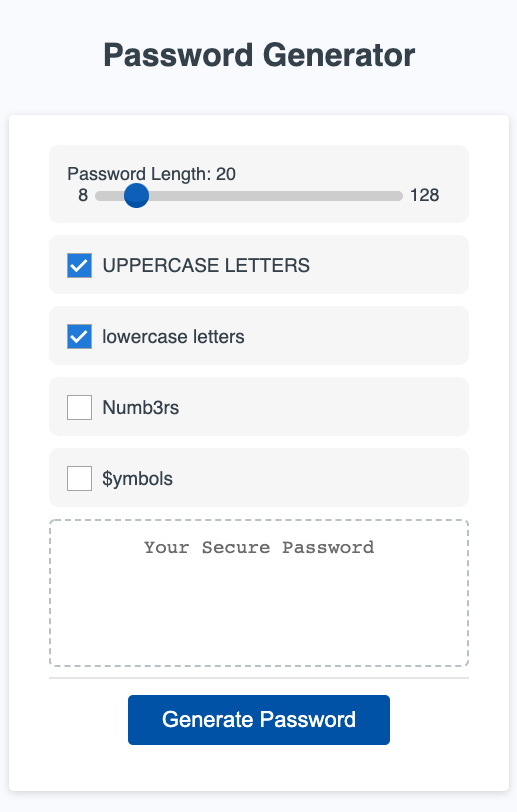

# JavaScript Password Generator

This is a simple application for generating random passwords with a handful of settings including:

1. Slider for password length
1. Include or exclude uppercase letters
1. Include or exclude lowercase letters
1. Include or exclude numbers
1. Include or exclude special characters

## Screenshot

The following image demonstrates the application functionality:

